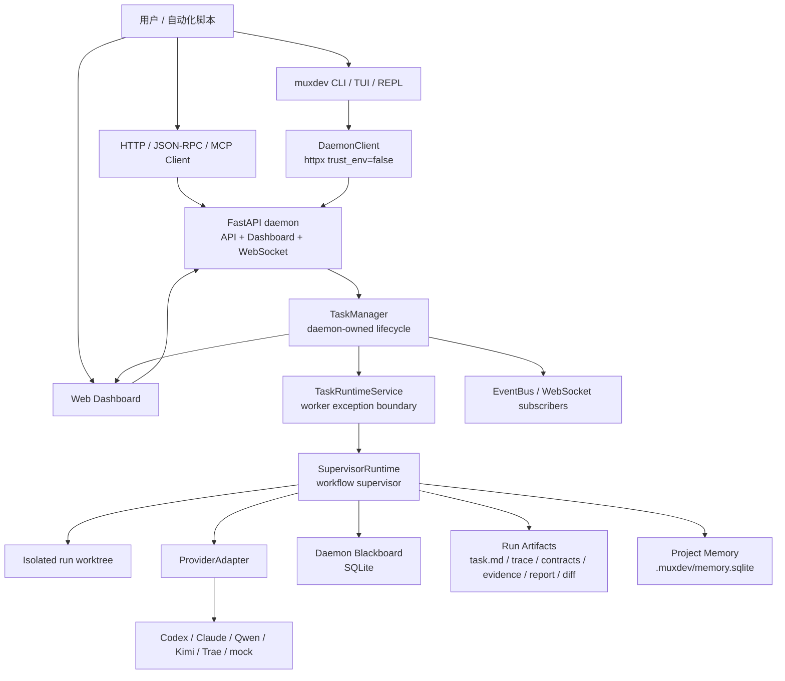
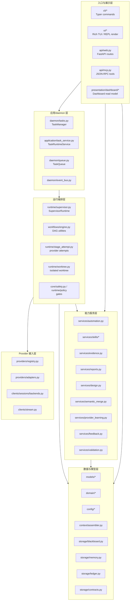
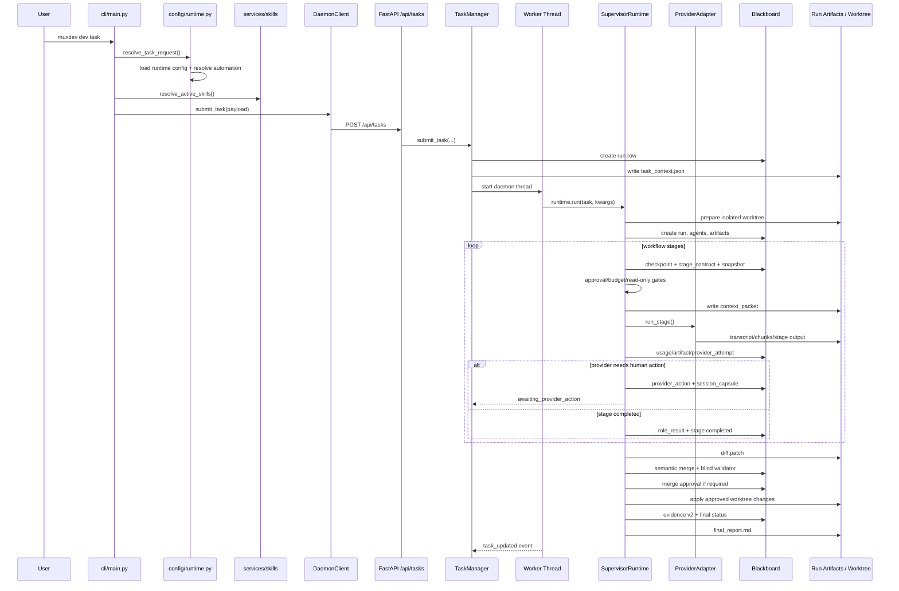
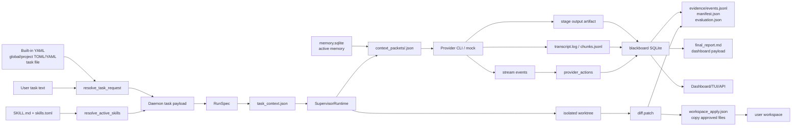
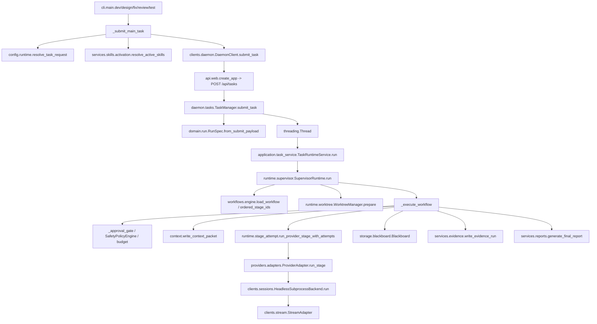
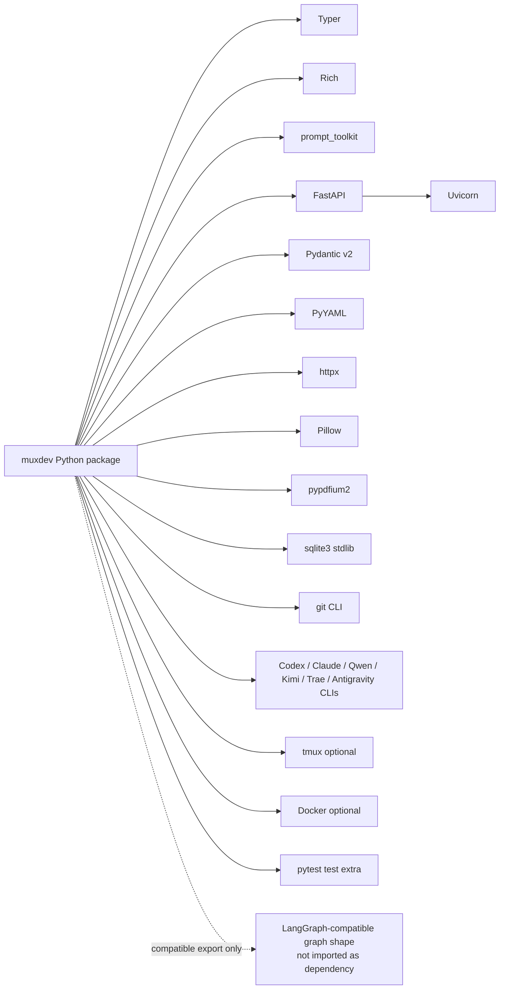

# muxdev 深度代码剖析与架构设计

本文基于当前仓库代码静态阅读生成，覆盖技术栈、外部依赖、架构图、请求生命周期、数据流、核心调用链、关键文件导读、可扩展性与风险点。

## 1. 总体定位

`muxdev` 是一个本地优先的 Agentic SDLC 控制面。它不是单个 AI 编码 CLI 的薄包装，而是把多个 provider CLI、工作流 DAG、本地 daemon、审批、provider handoff、证据、记忆、报告、回滚和 Dashboard/TUI 组合成一个可追踪的软件交付内核。

核心设计可以概括为：

```text
User command
  -> local daemon control plane
  -> workflow supervisor runtime
  -> provider CLI stages in isolated worktree
  -> blackboard/evidence/artifacts/reports
  -> optional approved workspace apply
```

从代码规模看，`src/muxdev` 当前约 139 个 Python 文件、约 2.84 万行。最大热点模块是：

| 文件 | 行数级别 | 角色 |
| --- | ---: | --- |
| `src/muxdev/cli/main.py` | 3500+ | Typer 命令注册中心 |
| `src/muxdev/runtime/supervisor.py` | 2100+ | workflow 执行主循环 |
| `src/muxdev/storage/blackboard.py` | 1500+ | SQLite 状态事实库 |
| `src/muxdev/api/web.py` | 1000+ | FastAPI API 和 Dashboard 入口 |
| `src/muxdev/daemon/tasks.py` | 800+ | daemon 任务生命周期边界 |
| `src/muxdev/services/ux.py` | 800+ | UX/Dashboard 摘要模型 |

## 2. 技术栈与外部依赖

### 2.1 语言、包管理与运行形态

- 语言：Python `>=3.11`
- 包布局：`src/` layout，`setuptools>=68`
- CLI 入口：`pyproject.toml` 中注册 `muxdev = "muxdev.cli:app"`
- 本地状态：文件系统 + SQLite + JSON/JSONL/Markdown artifacts
- 并发：daemon 使用 Python `threading.Thread`；parallel workflow 使用 `ThreadPoolExecutor`
- 子进程：provider CLI、Git、探测命令均通过 `subprocess`

### 2.2 Python 依赖

`pyproject.toml` 中声明的运行依赖：

| 依赖 | 用途 |
| --- | --- |
| `pydantic>=2` | workflow/domain/API/evidence/validation 模型 |
| `pyyaml>=6` | bundled YAML 配置、workflow 定义 |
| `typer>=0.12` | CLI 命令框架 |
| `rich>=13` | CLI/TUI 表格、Panel、文本渲染 |
| `prompt_toolkit>=3` | TUI/REPL 输入体验 |
| `fastapi>=0.110` | daemon HTTP API、Dashboard、WebSocket |
| `uvicorn>=0.27` | daemon API/Dashboard 服务进程 |
| `httpx>=0.27` | 本地 daemon client、TTS HTTP 请求 |
| `pillow>=10` | offline render 图像处理 |
| `pypdfium2>=4.30` | PDF/offline render |

测试依赖：

| 依赖 | 用途 |
| --- | --- |
| `pytest>=8` | 单元/集成测试 |

代码中还大量使用 Python 标准库：`sqlite3`、`subprocess`、`threading`、`asyncio`、`pathlib`、`dataclasses`、`tomllib`、`json`、`hashlib`、`concurrent.futures` 等。

### 2.3 是否使用 LangGraph / LangChain

当前代码没有安装或导入 `langgraph`，也没有导入 `langchain`。仓库里只存在一个导出适配函数：

- `src/muxdev/services/orchestration.py::workflow_to_langgraph`

它把 muxdev 自己的 `WorkflowDefinition` 转成 LangGraph-compatible 的 `{nodes, edges}` 数据结构，供外部系统理解 workflow DAG。也就是说：

- 使用了“LangGraph 兼容导出格式”。
- 没有直接使用 LangGraph 框架运行 workflow。
- workflow 的真实执行由 `src/muxdev/runtime/supervisor.py::SupervisorRuntime` 完成。

### 2.4 外部系统与本地工具依赖

| 外部对象 | 接入方式 | 说明 |
| --- | --- | --- |
| Codex CLI | headless subprocess | 默认配置为 `codex --ask-for-approval never exec --json --sandbox workspace-write`，prompt 走 stdin |
| Claude Code CLI | headless subprocess | 默认 `claude -p` |
| Qwen CLI | headless subprocess | 默认 `qwen --bare --approval-mode auto --output-format stream-json -p` |
| Kimi / Trae / Antigravity | headless subprocess | 配置预留，generic probe |
| mock provider | Python 内置类 | 离线确定性 provider，用于 demo/test |
| Git | subprocess | worktree 准备、diff、clean、apply、回滚 |
| tmux | optional subprocess | POSIX attach 能力 |
| Docker | optional subprocess | session backend 占位能力 |
| SQLite | stdlib `sqlite3` | daemon blackboard、memory、ecosystem store |
| FastAPI/Uvicorn | HTTP/WebSocket | 本地 API、Dashboard、事件流 |

## 3. 架构设计图

### 3.1 系统上下文图



### 3.2 模块分层图



### 3.3 请求生命周期图

以 `muxdev dev "add tests" --provider mock --json` 为例：



### 3.4 数据流图



### 3.5 核心类/函数调用链



### 3.6 外部依赖图



## 4. 核心流程讲解

### 4.1 命令入口与请求归一化

入口集中在 `src/muxdev/cli/main.py`。

关键路径：

1. `dev()` / `fix()` / `review()` / `test_command()` / `design()` 接收 Typer 参数。
2. 这些命令统一调用 `_submit_main_task(...)`。
3. `_submit_main_task` 调用 `config.runtime.resolve_task_request(...)`。
4. `resolve_task_request` 合并配置、解析 profile/gate/workflow/depth/role provider/skill specs。
5. `services.automation.resolve_automation(...)` 根据命令、任务文本、repo markers、敏感词、memory context 决定 intent、depth、topology、roles。
6. `services.skills.activation.resolve_active_skills(...)` 将显式 skill、role binding、metadata auto-match 解析成 active skill payload。
7. `DaemonClient.submit_task(...)` 把 payload 发到 `POST /api/tasks`。

这说明 CLI 只是入口适配和展示层。真正状态不应该落在 CLI 内，而应该通过 daemon 或 service/runtime 层。

### 4.2 API 与 daemon 生命周期

API 入口在 `src/muxdev/api/web.py::create_app`。它创建 FastAPI app，并把绝大多数路由委托给 `TaskManager`。

核心路由：

- `POST /api/tasks` -> `TaskManager.submit_task`
- `GET /api/tasks` -> `TaskManager.list_tasks`
- `GET /api/tasks/{task_id}` -> `TaskManager.task_detail`
- `POST /api/tasks/{task_id}/continue` -> `TaskManager.continue_task`
- `GET /api/provider-actions` -> `TaskManager.provider_actions`
- `POST /api/provider-actions/{action_id}/handled` -> `TaskManager.respond_provider_action` 或 `update_provider_action`
- `GET/POST /api/approvals...` -> muxdev approval 决策
- `WS /events` 和 `WS /api/events` -> daemon event queue

`TaskManager.submit_task` 的职责：

1. 将 API payload 变成 `RunSpec`。
2. 创建 project run dir，写入 `task_context.json`。
3. 在 daemon blackboard 创建 run 记录。
4. 启动 worker thread。
5. 广播 `task_submitted`。

`TaskRuntimeService` 是 worker 异常边界。它调用 runtime，如果抛异常则写入 `worker_exception` 并把 run 标记为 `blocked`。

### 4.3 Runtime 执行主循环

`src/muxdev/runtime/supervisor.py::SupervisorRuntime` 是系统中心。

`run()` 做初始化：

1. 创建 run id、run dir。
2. `WorktreeManager.prepare(...)` 准备隔离 worktree。
3. 创建 `Blackboard`、`TraceWriter`、`SafetyPolicyEngine`。
4. `load_workflow(workflow_name)` 加载 workflow DAG。
5. 合并 task context、skills、role provider、automation。
6. 写 `task.md`、`workflow.yaml`、`task_context.json`。
7. 创建 run、agent、artifact、ledger、trace。
8. 调用 `_execute_workflow(...)`。

`_execute_workflow()` 是核心阶段循环：

1. 读取已完成 stage，用于 resume/retry 跳过。
2. 如果 workflow 支持且满足 `_can_use_parallel_runtime`，进入 parallel executor。
3. 按拓扑序遍历 stage。
4. 对每个 stage：
   - 写 checkpoint。
   - 标记 stage running。
   - 通过 `ProviderPlanner` 选择 provider。
   - 记录 stage snapshot。
   - 写 stage contract。
   - human gate 进入 approval gate。
   - write/shell/budget gate 检查。
   - 写 context packet。
   - 调用 provider stage attempt。
   - 记录 usage、artifact、provider attempt。
   - 解析 provider action。
   - 处理 provider failure、read-only violation。
   - 解析 test/review output。
   - 写 role result contract。
   - 处理 review/fix loop。
5. 所有 stage 完成后：
   - 写 `diff.patch`。
   - 运行 semantic merge reviewer。
   - 运行 Blind Validator Panel。
   - merge approval gate。
   - apply approved worktree changes 到原 workspace。
   - 写 Evidence v2。
   - 生成 final report。
   - 刷新 provider learning。
   - 写 run completed ledger/trace。

### 4.4 Provider Action 与 muxdev Approval 的分离

这是 muxdev 的关键边界。

`muxdev Approval`：

- 来自 muxdev 自己的安全策略：plan/write/shell/merge/external/design。
- 写入 `approvals` 表。
- 由 `_approval_gate(...)` 根据 `subject_hash` 判断是否复用、等待、或发现 subject drift。

`Provider Action`：

- 来自外部 provider CLI/session 阻塞，例如登录、限流、确认提示、idle timeout。
- `HeadlessSubprocessBackend` 捕获 stdout/stderr。
- `StreamAdapter` 用正则识别 approval prompt/auth/rate-limit/idle。
- runtime 写入 `provider_actions` 表和 session capsule。
- 用户处理 provider session 后，调用 handled/response。
- `resume()` 再次运行未完成 stage，并把已处理 response 放进 context packet。

这个分离避免了把外部 CLI 的确认提示伪装成 muxdev 自己的安全审批。

### 4.5 Evidence v2 与可信交付

`services/evidence.py::write_evidence_run` 从 blackboard 派生证据：

- task evidence
- diff/change evidence
- stage evidence
- artifact evidence
- test evidence
- review evidence
- validator evidence
- approval evidence
- runtime error evidence
- semantic merge evidence

然后写：

- `evidence/events.jsonl`
- `evidence/manifest.json`
- `evidence/evaluation.json`

并把派生结果同步到：

- `evidence_events`
- `evidence_manifests`
- `evidence_evaluations`

event 使用 `prev_hash` 和 `event_hash` 形成 hash chain。`verify_run_evidence` 会校验事件链、manifest head hash、artifact ref hash 与 blackboard 持久化 hash。

### 4.6 Memory 与 Context Packet

Memory 不直接等于证据，也不直接等于 provider prompt。它是单独的项目本地 SQLite：

- 默认路径：`<repo>/.muxdev/memory.sqlite`
- 层级：session/run/branch/project/workspace/user
- 状态：proposed/active/quarantined
- promotion state：proposed/approved/quarantined
- 支持 contradiction detection 和 auto quarantine

每个 stage 前，`context/assembler.py::write_context_packet` 会把 memory、provider attempts、handled provider action response、review blockers、skills 等写成：

```text
context_packets/<stage>.json
```

然后把 packet path/hash 附加到 provider task prompt 中。这是 provider 获取上下文的稳定边界。

## 5. 关键文件导读

| 文件 | 关键职责 | 维护提示 |
| --- | --- | --- |
| `pyproject.toml` | 包元数据、依赖、CLI entry point、pytest 配置 | 查技术栈从这里开始 |
| `src/muxdev/cli/main.py` | Typer app、自然语言任务 fallback、主命令提交、各类本地命令 | 文件过大，新增业务逻辑应优先下沉到 service/daemon/runtime |
| `src/muxdev/cli/providers.py` | provider 子命令 | detect/doctor/install/account 的 CLI 包装 |
| `src/muxdev/clients/daemon.py` | 本地 HTTP client | `trust_env=False` 避免 localhost 被代理污染 |
| `src/muxdev/api/web.py` | FastAPI app、REST API、WebSocket、Dashboard HTML 入口 | API 应尽量委托给 `TaskManager` 或 service |
| `src/muxdev/api/mcp.py` | JSON-RPC/MCP-compatible tool surface | 默认偏读，写操作走 guardrail |
| `src/muxdev/daemon/tasks.py` | daemon-owned task lifecycle、worker、状态读模型入口 | daemon 全局状态写入边界 |
| `src/muxdev/application/task_service.py` | worker runtime 调用与异常落库 | 让 daemon worker 失败可追踪 |
| `src/muxdev/domain/run.py` | `RunSpec`、`SkillRef`、`PolicySpec` | API payload 与 runtime kwargs 的 typed contract |
| `src/muxdev/config/runtime.py` | TOML-first runtime config、profile/gate/workflow/role/skill 请求解析 | 当前主路径配置入口 |
| `src/muxdev/config/loader.py` | bundled YAML + user/project/env YAML 合并 | provider/workflow/path defaults 从这里来 |
| `src/muxdev/config/defaults/workflows.yaml` | 内置 workflow DAG | 增加 workflow 首先改这里或提供自定义 YAML |
| `src/muxdev/config/defaults/providers.yaml` | provider CLI 默认配置 | 新增 provider 的第一站 |
| `src/muxdev/workflows/engine.py` | workflow 加载、DAG 校验、拓扑排序、parallel batch、when 条件 | 当前不是 LangGraph runtime |
| `src/muxdev/runtime/supervisor.py` | run/resume/retry、stage loop、gates、provider 调度、证据/报告闭环 | 系统最核心也最复杂的模块 |
| `src/muxdev/runtime/stage_attempt.py` | provider attempt retry、failure kind、provider action extraction | provider 稳定性逻辑在这里集中 |
| `src/muxdev/runtime/worktree.py` | isolated worktree 准备 | Git 隔离和 fallback 行为要看这里 |
| `src/muxdev/providers/registry.py` | provider 静态探测 | 不做模型调用，只跑 bounded help/version probe |
| `src/muxdev/providers/adapters.py` | mock/headless provider runtime adapter | 真实 provider 执行桥 |
| `src/muxdev/providers/mock.py` | deterministic mock provider | demo/test 的离线闭环 |
| `src/muxdev/clients/sessions/backends.py` | headless subprocess、tmux、docker、conpty session backend | transcript/chunks/idle timeout 在这里 |
| `src/muxdev/clients/stream.py` | provider stream 解析 | 正则识别 confirmation/auth/rate-limit/idle |
| `src/muxdev/storage/blackboard.py` | SQLite schema 和 CRUD facade | daemon/run 状态事实源 |
| `src/muxdev/storage/contracts.py` | stage/role/validator contract hash artifact | trusted delivery 的结构化 artifact |
| `src/muxdev/storage/ledger.py` | hash-chained ledger.jsonl | 事件链完整性 |
| `src/muxdev/storage/memory.py` | evidence-grounded layered memory | 提案、晋升、矛盾检测、隔离 |
| `src/muxdev/services/evidence.py` | Evidence v2 event/manifest/evaluation/verification | 最终可信度评估 |
| `src/muxdev/services/reports.py` | final report 生成 | 用户阅读的交付摘要 |
| `src/muxdev/services/automation.py` | deterministic intent/depth/topology/roles 决策 | 不调用 LLM |
| `src/muxdev/services/skills/*` | skill discovery、catalog、trust、activation、selection、lock、eval | 技能治理主实现 |
| `src/muxdev/context/assembler.py` | per-stage context packet | provider 上下文注入边界 |
| `src/muxdev/services/semantic_merge.py` | semantic merge reviewer | final patch gate 的一部分 |
| `src/muxdev/services/provider_scores.py` | provider score 汇总 | provider routing/learning 输入 |
| `src/muxdev/services/provider_learning.py` | provider learning snapshot | 跨 run 学习 |
| `src/muxdev/presentation/dashboard/overview.py` | Mission Control overview read model | Dashboard 聚合模型 |
| `src/muxdev/ui/tui.py` | Rich TUI 渲染 | 只负责展示，不拥有 daemon 状态 |

## 6. 可扩展性分析

### 6.1 新增 provider

推荐路径：

1. 在 `src/muxdev/config/defaults/providers.yaml` 增加 provider 配置。
2. 如果是普通 CLI，优先使用 `runtime.kind = headless_cli`。
3. 配置 `commands`、`runtime.command`、`prompt_template`、`prompt_transport`。
4. 如果静态能力判断需要更准，在 `providers/registry.py` 增加 probe 分支。
5. 如果 CLI 行为无法用通用 subprocess 表达，再扩展 `providers/adapters.py`。

优点：当前 provider runtime 已经配置驱动，mock/headless adapter 接口较薄。

风险：`get_runtime_provider()` 当前调用 `load_config()` 时没有传入 task workspace，多项目 daemon 场景下 project config 覆盖可能不生效。

### 6.2 新增 workflow

推荐路径：

1. 在 `config/defaults/workflows.yaml` 增加 workflow。
2. 用 `WorkflowStage` 字段表达 deps、role、read_only、allow_write、allow_shell、human_gate、when、loop。
3. `workflows/engine.py` 会做 DAG 校验和拓扑排序。
4. 如果需要 parallel，设置 `max_parallel > 1`，但 runtime 只有在 `_can_use_parallel_runtime()` 通过时才走并行。

优点：workflow 定义与执行分离，DAG 不依赖外部框架。

风险：`should_run_when()` 是一个很小的表达式语言，只支持少数 review loop 条件，不是通用表达式引擎。

### 6.3 新增 skill

推荐路径：

1. 新增 `SKILL.md` 和 `muxdev.skill.toml`。
2. 通过 `services/skills/discovery.py` 扫描。
3. 通过 `selector.py` 进行显式激活、role binding 或 metadata auto-match。
4. 通过 `activation.py` 注入 provider prompt/context。
5. 通过 skill lock/evals 做治理。

优点：skill 系统较完整，已分拆为 discovery/catalog/trust/activation/selection/evals/lock。

风险：CLI 和 runtime 都会 resolve skill，重复激活/内容注入需要继续靠 `_merge_skill_payloads` 去重。

### 6.4 新增证据或可信交付规则

推荐路径：

1. 如果是原始事实，先写入 blackboard 新表或已有表。
2. 在 `services/evidence.py::_collect_events` 增加 EvidenceEvent。
3. 在 `_required_matrix` 或 `_build_evaluation` 调整 gate-first evaluation。
4. 在报告/Dashboard read model 中展示。

优点：Evidence v2 是派生层，事实源和评估层分离清楚。

风险：当前 evidence evaluation 是规则聚合，不是可配置 policy；复杂组织规则可能会让 `services/evidence.py` 继续变大。

### 6.5 新增 API/Dashboard 能力

推荐路径：

1. 状态写操作进入 `TaskManager` 或明确的 service。
2. `api/web.py` 只做 Pydantic request、异常转 HTTPException、委托调用。
3. Dashboard 聚合逻辑放 `presentation/dashboard/overview.py` 或 read model。

优点：已有 Dashboard read model。

风险：`api/web.py` 和 `api/live_dashboard.py` 已经偏大，继续叠加会降低维护性。

## 7. 风险点与改进建议

| 风险点 | 影响 | 证据/位置 | 建议 |
| --- | --- | --- | --- |
| `cli/main.py` 与 `runtime/supervisor.py` 过大 | 维护成本高，回归面大 | CLI 3500+ 行，runtime 2100+ 行 | 拆分 command groups、stage runner、gate manager、finalization pipeline |
| SQLite `PRAGMA journal_mode=OFF` | 崩溃一致性与并发写风险 | `storage/blackboard.py`、`storage/memory.py` | 非 sandbox 环境优先 WAL；增加迁移/备份/恢复策略 |
| daemon worker 是内存线程 | daemon 重启后运行中 worker 不可恢复 | `TaskManager.workers`、`TaskQueue` | 引入 durable queue state，启动时扫描 running/created run 并标记 recoverable |
| provider config 未显式绑定 workspace | 多项目 daemon 可能读错 project config | `providers/adapters.py::get_runtime_provider` 使用 `load_config()` 默认 cwd | 给 provider registry/adapter 传 workspace |
| provider prompt 解析基于正则 | 误判/漏判 auth、approval、rate limit | `clients/stream.py` | 为常见 provider 增加结构化 parser；记录原始 chunks 供回放 |
| workspace apply 只 copy changed files | 删除文件、chmod、复杂 rename 可能不反映到原仓库 | `_changed_worktree_files` 使用 `--diff-filter=ACMRT`，`_apply_approved_worktree_changes` 只 `copy2` | 用 `git apply` 或 patch-based apply 支持 delete/rename/mode |
| 并行 stage 共用 worktree | 未声明写冲突时可能互相覆盖 | `_execute_parallel_workflow` + planned write conflict | 并行 stage 使用独立 worktree 后做 semantic merge 更稳 |
| schema 演进靠内联 `_ensure_column` | 多版本升级容易遗漏 | `Blackboard._init_schema` | 引入 schema version 和 migration 脚本 |
| API/Dashboard 前端内联较大 | UI 迭代困难，测试粒度粗 | `api/live_dashboard.py` 1000+ 行 | 拆出静态资源或组件化模板，保留 API read model |
| shell policy 抽象偏窄 | 目前 stage shell gate 示例硬编码 `pytest` | `_execute_workflow` 中 `policy.evaluate_shell("pytest")` | 将 stage command 或 provider-declared shell actions 纳入 policy subject |
| Evidence evaluation 规则硬编码 | 组织级 gate 难配置 | `services/evidence.py::_build_evaluation` | 抽出 policy config 或 pluggable evaluator |
| provider action handled 语义依赖 rerun | 用户响应不是直接注入原 CLI session | `continue_task` + context packet response | 对支持 resume/attach 的 provider 增加真实 resume adapter |

## 8. 设计优点总结

- daemon 是状态写入边界，CLI/TUI/API 不直接各自维护 lifecycle。
- workflow 是 DAG 数据模型，执行器可 resume/retry/skip completed stage。
- muxdev approval 与 provider action 分离，概念边界清楚。
- Evidence v2 与 ledger 都使用 hash chain，提高可审计性。
- Memory 与 evidence 分离，且有 promotion/quarantine 机制，避免随意污染长期上下文。
- provider 接入以 headless CLI 为主，mock provider 保障离线 demo/test。
- Dashboard/TUI/API 共享 blackboard/read model，用户可见性较好。

## 9. 一句话架构结论

`muxdev` 当前实现是一个以 FastAPI daemon + SQLite blackboard + SupervisorRuntime DAG 执行为核心的本地 AI 编码交付控制面；它没有直接使用 LangGraph，而是自己实现 workflow 编排，并把外部 provider CLI 当作可审计、可恢复、可治理的 stage executor。
