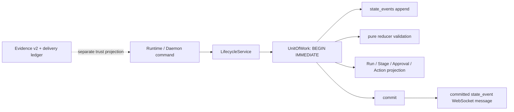

# muxdev v0.2 Week 2: Event-Driven State And Reliable Storage

Status: **implemented repository increment**, 2026-07-18. This document covers
the second delivery week only. It does not claim that durable scheduling,
exactly-once provider effects, signed attestations, or the complete v0.2 product
have shipped.

## Why This Change Exists

Before this increment, Blackboard and MemoryStore opened SQLite with
`journal_mode=OFF`, updated related records through independent commits, and
altered old databases opportunistically during startup. A crash could leave a
status without its error, an approval without a matching transition, or a test
process holding an unexplained database shape. The existing Evidence ledger
could prove delivery facts, but it was not an operational state source.

The new design separates those responsibilities:



`state_events` answers “what operational transition happened?” Evidence v2
answers “what delivery claim is supported?” Operational event hashes detect
accidental corruption and ordering errors; they are not signatures and must not
be presented as independent attestation.

## Implemented Contract

### SQLite foundation

Blackboard and MemoryStore now use the same `SQLiteEngine`:

- WAL, `synchronous=FULL`, foreign keys, and a 5,000 ms busy timeout are the
  normal mode.
- WAL failure falls back to `DELETE + FULL` and reports `degraded`; OFF is not
  an accepted mode.
- writes use `BEGIN IMMEDIATE`; nested units of work use savepoints;
  compatibility `commit()` calls cannot break an enclosing transaction.
- read-only connections use `mode=ro`, never migrate, and expose
  `migration_required`.
- migration history is stored in
  `schema_migrations(component, version, name, checksum, applied_at)`.
- legacy databases receive a consistent pre-migration SQLite backup; the five
  newest migration backups are retained.
- changed checksums and schema versions newer than the running code fail fast.

Blackboard schema v1 establishes the prior tables; v2 adds operational events,
aggregate versions, Run history completeness, and Stage attempts. Memory schema
v1 fixes the current layered-memory shape. Runtime `_ensure_column` migrations
have been removed.

### Operational state

Every `StateEventEnvelope` contains a Run-local sequence, event and schema
version, idempotency key, causation/correlation identifiers, payload, time, and
a previous/current hash pair. `(run_id, sequence)` and
`(run_id, idempotency_key)` are unique.

The first event set covers Run creation/transitions, Stage transitions,
approval request/decision, Provider Action request/response/transition, Worker
failure, and legacy Run import. The reducer is a pure domain function: it has no
database, filesystem, provider, or environment access.

Important invariants:

- an aborted Run cannot reopen;
- blocked/completed Runs require an explicit recovery reason;
- a Stage retry increments `attempt` and records its reason;
- unknown event versions and illegal transitions cannot update projections;
- event append, reducer validation, aggregate version, and projection update
  commit or roll back together;
- repeated idempotency keys return the original committed event;
- legacy Runs begin with `legacy_run.imported` and
  `history_complete=false`; newly created Runs are replayable from sequence 1.

The compatibility Blackboard methods remain temporarily available, but the
Runtime and Daemon lifecycle paths call `LifecycleService`. Compatibility calls
that historically skipped an intermediate state create an explicit bridge
event rather than weakening the reducer.

### Files and terminal completion

Provider stage output uses same-directory temporary files, fsync, and atomic
rename, so readers never observe partial content. `LifecycleService` also
provides the complete file-first stage commit protocol and leaves a hashed,
recognizable orphan marker if the database projection fails. Orphans can be
inspected or adopted by the reconciliation helper.

SQLite and the filesystem cannot share a native transaction. muxdev therefore
chooses the safe failure direction: a crash can leave a verifiable orphan file,
but the database must not claim that a missing file was delivered.

`completed` is appended only after workflow deliverables, Evidence, the report,
and the completion ledger entry exist. The report is regenerated after commit
so its read model displays the terminal state. A later repair uses a new
completion-cycle idempotency key.

## Backup, Restore, And API

CLI:

```text
muxdev storage status [--scope daemon|project|all]
muxdev storage backup [--scope daemon|project|all] [--output PATH]
muxdev storage verify ARCHIVE
muxdev storage restore ARCHIVE --yes
muxdev storage replay RUN_ID
```

Backups use SQLite's online backup API. The ZIP contains only database
snapshots and a manifest with logical name, component, schema version, size,
and SHA-256. It excludes worktrees, provider credentials, process environments,
and full artifact directories.

Verification rejects unsafe ZIP names, undeclared files, duplicate logical
targets, hash mismatches, failed SQLite integrity checks, and unsupported
schemas. Restore requires a stopped Daemon and `--yes`, creates a pre-restore
archive, stages and verifies every database, atomically replaces database
files, handles WAL sidecars, and restores rollback copies if any replacement
fails.

Local HTTP exposes only:

```text
GET  /api/storage/status?scope=...
POST /api/storage/backups
POST /api/storage/backups/{backup_id}/verify
GET  /api/runs/{run_id}/replay
```

HTTP responses omit database paths. HTTP accepts only server-generated backup
IDs, stores archives below the Daemon-controlled backup directory, and rejects
non-local browser Origins for backup mutations. There is no HTTP restore,
migration, arbitrary-path, or SQL route.

## Failure Model And Demo

A concise interview/demo path is:

1. Run a mock task and show ordered Run/Stage events.
2. Inject a transaction failure and show that neither event nor projection was
   committed.
3. Run `muxdev storage replay <run-id>` and show zero projection differences.
4. Create an online backup while the database remains readable.
5. Verify its hashes and SQLite integrity.
6. Change state, stop the Daemon, restore with `--yes`, and replay the restored
   Run.

This demonstrates a useful production property rather than a feature count:
muxdev can explain state, reject corrupted history, and recover local control
plane data without trusting a provider transcript.

## Delivered In Week 3

- persistent queue records, fenced leases, heartbeats, cooperative cancellation,
  and restart reconciliation are implemented in the Week 3 repository increment;

## Deferred Beyond Week 3

- exactly-once external Provider effects (local state is idempotent, remote
  side effects are not claimed to be);
- multi-host databases or team storage;
- cryptographic signing and independent delivery attestation;
- automatic repair by replay. Week 2 replay is deliberately read-only.
