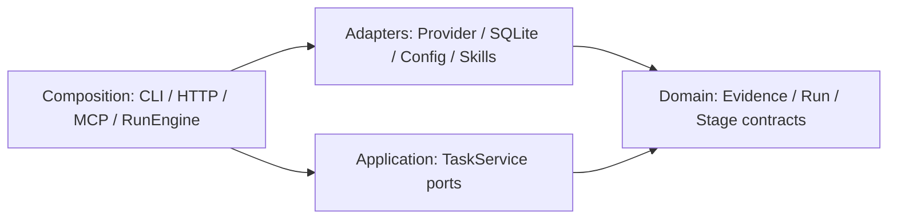
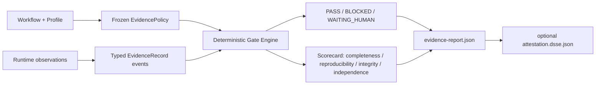

# muxdev architecture diagrams

## Four layers



## Durable recovery

```mermaid
sequenceDiagram
  participant U as User
  participant E as RunEngine
  participant S as ControlStore
  participant P as ProviderAdapter
  U->>E: run or resume
  E->>S: persist job and stage=running
  E->>P: execute(StageExecutionInput)
  P-->>E: StageExecutionResult
  E->>S: persist output, usage, evidence, stage=completed
  alt human decision required
    E->>S: interaction=pending
    E-->>U: WAITING_HUMAN
    U->>S: approved/rejected
    U->>E: resume
  end
  E->>S: replay completed stages; reconcile opaque running stage
```

## Evidence and gate data flow


